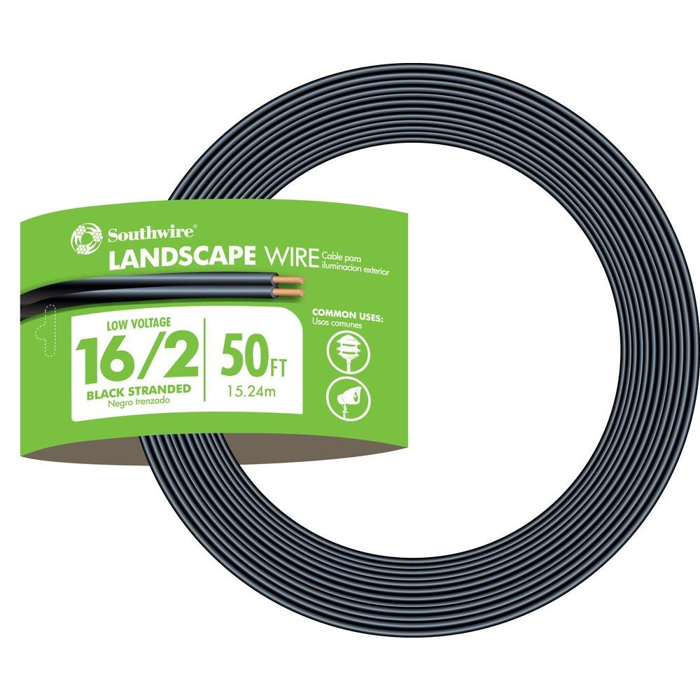

I could not find **any** suitable outdoor gallery light fixture for my wife's succulent planter. 
I understand that "suitable" is rather subjective, but a reasonable outdoor fixture need to be powered from
a 12V AC landscape circuits, be weatherproof and be cheap to replace. IMHO this is not really a long list
of requirements. 

Note that weatherproofing of landscape lights fixtures is rather simplistic - plastic needs to withstand 
multiple years of UV light exposure, electronics (if any) is in watertight enclosures, 
bare wire connections drowned in dielectric grease. 

Since I could not find it, I had to build my own. 

#Bom

 . | item | price| link
 --- | --- | --- | ---
  | G4 AC/DC 12v led bulbs that have AC rectifier circuit sealed |$9 for 5 | [amazon][1]
 | ceramic G4 base| $7 for 5 | [amazon][3]
 | PETG for plastic, you will use ~$1.5 worth of it per lamp| $23 | [amazon][2]
 | 50' 16/2 AWG landscape wire| $15 | [homedepot][4]

Other pats I had on hands.
* M4 bolts and nuts
* 1-1/2" ABS pipe
* wire nuts
* dielectric grease
* two part epoxy
* circular saw 
* copper foil 
* black spray paint
* xt60 connectors

If you can get 18/2 or thinner outdoor wire - get it, current consumption of a single G4 led is 80mA @ 12V. 
You might as well consider making them battery powered but outdoor mechanical switches might not be cheap 
and water will get into your battery enclosure. Solar powered light is another option, but it might 
not be bright enough for long enough.

You can also skip foil decoration bit.

# This is how it looks installed.

 

# Fusion 360

 [Project file](./fusion360-model.f3d)

Notice that if you have ABS drain pipe lying around, you can skip printing cylinder-shaped body and as a bonus 
get no layers marks.

# Printed and assembled
 

I cut a shallow groves 1/8" wide with a circular saw and put thin stripes of copper foil. Pieces assembled 
together with two part epoxy. The only non-rigid revolving joint is between the handle and the cyclinder. 
Use M4 bolt and nut there. Friction is enough to hold the cylinder in a position you chose.  
I knew I had to take the frame off the fence multiple times, so I added [XT60 connectors](./xt60.jpeg).

# STLs

[cylinder-handle](./cylinder-handle.stl)
[handle.stl](./handle.stl)
[pipe.stl](./pipe.stl)
[plate.stl](./plate.stl)
[plug.stl](./plug.stl)

[1]: https://www.amazon.com/gp/product/B07XFBWTXR/
[2]: https://www.amazon.com/gp/product/B07TRPPGT7
[3]: https://www.amazon.com/gp/product/B01N0FR7VL/
[4]: https://www.homedepot.com/p/Southwire-50-ft-16-2-Black-Stranded-CU-Low-Voltage-Landscape-Lighting-Wire-55213142/202316264